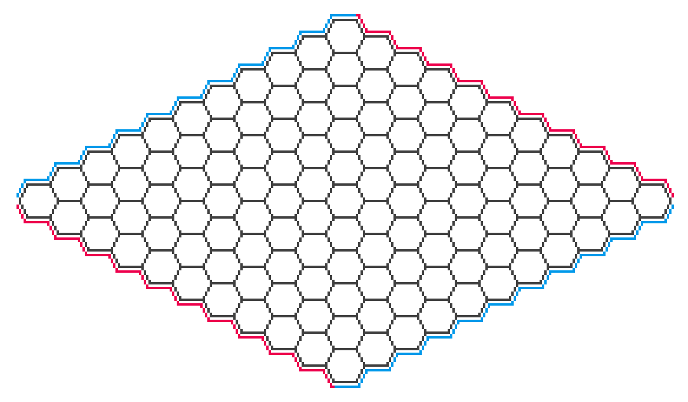
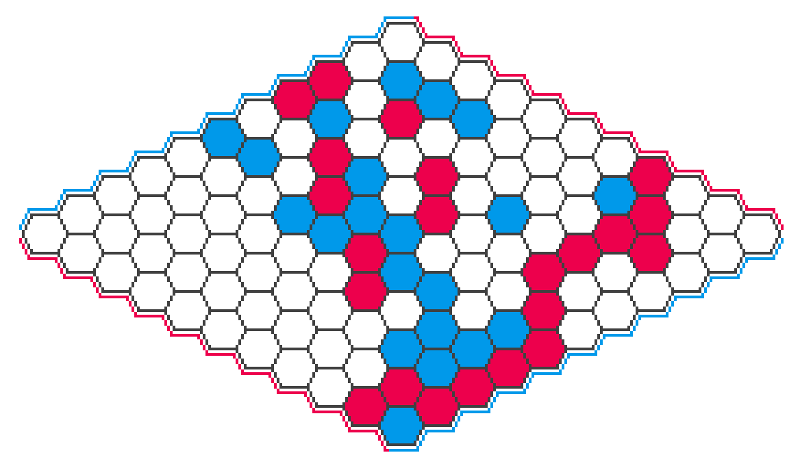

> This is the first post in a planned series of posts about my foray into
> building a bot to play Hex. The focus of this post is on Hex itself and board
> game algorithms more generally.

I've been vaguely aware of Hex for years, but didn't really *discover* it until
playing it in *Clubhouse Games: 51 Worldwide Classics* for Nintendo Switch. I
figured out rather quickly that it's a very strategically interesting game,
kind of the checkers to go's chess.

The game takes place on a grid of hexagonal tiles arranged in a rhombus. Many
sizes are possible, but $11 \times 11$ is popular:

Players take turns placing pieces in unoccupied hexagons racing to be the first
to make a path between the edges of their color:

That's all the rules![^swap] And yet despite this simplicity, Hex has a lot of
strategic depth. (I won't go into Hex strategy here. I'm not very good at the
game, and there are plenty of resources online for how to play hex including the
[Wikipedia article][wiki-hex]. However, if you want a taste for it, the best
thing to do would be to simply [try playing a few games][playhex]!)

> *Terminology note:* The choice of colors for the first and second player
> are a matter of convention. I've chosen to represent the first and second
> players as red and blue respectively, and I'll use this terminology
> consistently throughout these posts.

The simplicity of Hex gives it a number of interesting properties that are
easily shown from the rules.

- Games can never end in a draw, since blocking all paths for one color requires
making a complete path of the opposite color. This fact was known in 1942 by
Piet Hein, the game's inventor.

- It's known that there exists a strategy for the first player to force a win,
although the specific strategy is not yet known. This fact is reflected in the
strong first-player advantage in pure Hex, which is commonly corrected using
a swap rule. The first written existence proof was given by John Nash
in 1952, and board sizes up to 9x9 have been completely solved by computers.

The [Wikipedia article][wiki-hex] and [Wolfram MathWorld page][mathworld] for
Hex have additional information. Hex has also been written about extensively
in an academic context, especially in regards to game-playing AI, and there are
plenty of papers and other resources that discuss aspects of Hex in great
detail.

## Let's make a bot!

Making bots to play board games has always been an application of AI that
fascinates me, so naturally upon encountering Hex I decided I wanted to try
making a bot for it. I've made bots for board games before, such as for
[Khet][khet-table] (also known as Laser Chess), and most of what I've been doing
with Hex has been essentially a further iteration of that work. (The main
differences are that the Khet bots were all CPU-based, even the neural network
ones, and also that my math and programming skills have grown a bit since then.)

Our ultimate goal will be to build a bot similar to AlphaZero, an MCTS-based
search algorithm augmented by a neural network trained on self-play. Owing to
the popularity of Hex there are already plenty of *very* strong bots out there,
including prior art for this exact idea: [KataHex][katahex], a fork of KataGo,
is a popular AlphaZero-style bot for hex. But retracing those steps is
educational and fun, and what are board games about if not fun. The resulting
implementation is small, hackable, and surprisingly strong.

## How a computer plays a board game

Hex, like many abstract strategy games, can be thought of as tree of board
positions where the edges represent moves. The root of the tree is the initial
board state, and a game proceeds by descending down the move tree. This tree
is *enormous*, making it infeasible to search exhaustively even up to a fairly
shallow depth. Most algorithms still search the move tree, but use heuristics to
decide which parts of the tree are worth spending time exploring. Search
algorithms vary wildly, from highly complex algorithms incorporating a lot of
domain knowledge, to very general ones that need no more than just an
understanding of the rules.

A popular search algorithm is [alpha-beta search][wiki-alpha-beta], which
traverses the move tree using a number of heuristics in order to reduce the
branching factor. One such heuristic is a *value function* that can assign an
approximate "value" for a board state, e.g. for chess by scoring material
advantage. Though even simple value functions can result in good gameplay, the
strength of the algorithm relies on this function's accuracy, and necessarily
incorporates domain knowledge about the game, e.g. for chess the relative value
of the different pieces. Additionally, alpha-beta search performs better when
visiting the most promising moves first, called *move ordering*, which is yet
another way its performance relies on domain knowledge.  While the sensitivity
of alpha-beta search to domain knowledge is not by itself a problem (and indeed,
strong chess programs such as [Stockfish][wiki-stockfish] and
[Komodo][wiki-komodo] have used this algorithm to great success), it does
require the author to have some understanding about the game's strategy.[^alpha-beta]

The most general practical search algorithm is arguably a pure **Monte Carlo
tree search** (MCTS), where one only has to be able to take a board state and
determine if it's terminal (win/loss/draw) or enumerate all the valid moves from
it. The [Wikipedia article][wiki-mcts] provides a good explanation of how it
works, but since it forms the foundation of the AlphaZero-based model we will be
implementing, it's worth going over.

## Monte Carlo tree search (MCTS)

An MCTS search is iterative, where each iteration adds a new leaf node to a game
tree data structure kept in memory. The algorithm chooses where to add the node
by descending the tree, choosing edges in a way that balances *exploration* of
under-explored subtrees and *exploitation* of promising subtrees (from the
perspective of which player is to make the given move). Upon descending to
where a new leaf node is to be added, the algorithm performs a
*rollout* (also sometimes called a "simulation") to assign a value
(win/loss/draw) to the new node: random moves are played until reaching a
terminal state, which becomes the initial value of this node. This value is
then propagated back up the tree, with the average value of each subtree
being aggregated all the way up to the root.

These iterations can be performed as many times as desired, with each iteration
adding to the amount of information available at the root node. When the search
is stopped (e.g. by hitting an iteration count or computation time limit) the
algorithm plays the move represented by the node with the largest visit count,
i.e. the number of times the algorithm descended to that node. (Note that the
node with the largest *value* is not chosen, but the search algorithm will
visit high-value nodes many times, so this is a subtle but minor distinction.)

The reason MCTS works at all might not be immediately obvious, since valuing new
leaf nodes by playing random moves to the end of the game might seem like it
provides very little useful information at all. However, the idea is that each
iteration descends the move tree all the way to a single terminal state, using
information from previous traversals when available and random moves otherwise,
then aggregates this information up the tree for later iterations. In other
words each iteration of MCTS is *sampling* the entire move tree, with each new
sample adding more detail.

## Up next

In the next post, I'll be covering the board representation and go more in
depth on the baseline MCTS implementation.

[katahex]: https://www.hexwiki.net/index.php/KataHex
[khet-table]: https://github.com/aji/khet-table
[mathworld]: https://mathworld.wolfram.com/GameofHex.html
[playhex]: https://playhex.org/
[wiki-alpha-beta]: https://en.wikipedia.org/wiki/Alpha%E2%80%93beta_pruning
[wiki-deep-blue]: https://en.wikipedia.org/wiki/Deep_Blue_(chess_computer)
[wiki-hex]: https://en.wikipedia.org/wiki/Hex_(board_game)
[wiki-komodo]: https://en.wikipedia.org/wiki/Komodo_(chess)
[wiki-mcts]: https://en.wikipedia.org/wiki/Monte_Carlo_tree_search
[wiki-stockfish]: https://en.wikipedia.org/wiki/Stockfish_(chess)

[^swap]: An additional rule called the "swap rule" is commonly implemented as
well, in order to correct for the rather significant first-player advantage.
If playing with the swap rule, then after the first move the second player can
choose to swap sides, thus incentivizing the first player to choose a move that
is not too strong for either player.

[^alpha-beta]: It's interesting to think what kind of value function and move
ordering strategy could be used for a Hex bot based on alpha-beta search. Hex
strategy revolves essentially entirely around positional judgement, and concepts
like "material advantage" don't exist at all. There *are* alpha-beta
implementations for Hex and I'll leave it as a homework assignment to go learn
about what value functions they use.