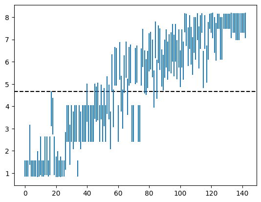

> This is the final post in a series of posts about my foray into building a bot
> to play Hex. The focus of this post is on quantifying the strength of our
> shiny new bot, plus some miscellaneous followups.
>
> [Hexbot Part 1: The 101 Unit][part-1]  
> [Hexbot Part 2: The Board and Our First Bot][part-2]  
> [Hexbot Part 3: Using Neural Networks][part-3]  
> Hexbot Part 4: Did It Work?

Now that we've trained up a neural network to play Hex, it would be nice to know
if our effort (and cloud computing bill) have paid off, and there are a number
of things we can do to get some insight here.

The first is to simply play against the bot to get a qualitative sense for how
well it plays. I've played a few games against it and while I'm still kind of
a beginner, it's clearly much stronger than me.[^play] I copied the moves
between it and the "Impossible" CPU in *Clubhouse Games* and it won. Both of
these with the model playing as the second player without the swap rule, and
with 2 seconds of thinking time per turn. Neither of these achievements is very
impressive though (even the *Clubhouse Games* "Impossible" difficulty is still
pretty weak in the grand scheme of Hex-playing programs) and they don't tell
us much about the bot's strength quantitatively.[^bots]

## Benchmarking against MCTS

In [part 2][part-2] we noted that the strength of MCTS can be configured by
changing the number of search iterations, i.e. the number of rollouts. Thus, we
might ask how many rollouts are required for MCTS to play at roughly the same
strength as our bot. Furthermore, we can check if this number actually increased
over the course of training, and at what rate.

As described in [part 3][part-3], the purpose of the neural network is to
augment an MCTS search with a value function and a prior over available moves,
but we can actually just use the prior (i.e. the policy) directly, evaluating
the current board once and immediately picking the move considered "most likely"
instead of searching the tree deeper. By finding the MCTS configuration that
wins about half of its games against this type of model-only strategy, we can
get a sense for the amount of "MCTS knowledge" contained within a model
checkpoint.

In principle we could run hundreds or thousands of games at different MCTS
strengths, but each game can take minutes to run so we would like to need as few
as them as possible since we have 142 checkpoints to evaluate.  Instead we can
use Bayesian inference on a distribution over a range of MCTS strengths, where
the likelihood is given by the win rate predictor we calibrated in
[part 2][part-2]. The prior informs the choice of which strength to try next, then we
calculate the mean and variance of the posterior distribution after a number of
experiments have been run.

The result of this analysis is the following plot:

The X axis is checkpoint index (correlating roughly with training time)
and the Y axis is the MCTS strength ($\log_{10}$ of rollout count) required to
get a roughly 50/50 win rate against the checkpoint playing in model-only mode.
(The dashed line marks the MCTS strength where the amount of time spent thinking
is the same for MCTS and a model-only move.) The Y axis stops at 8 because
100,000,000 rollouts is already quite a lot for my laptop to handle and the
analysis would take way too long if the MCTS were allowed to think any longer.
Clearly the latest checkpoints are much stronger than pure MCTS!

## Generalized benchmarking

The same type of analysis from the last section can be extended to *any* two
Hex-playing programs, since we have a single configuration axis we can use
for all of them: thinking time. That is, instead of asking how many rollouts
are required for pure MCTS to play at the same strength as a model checkpoint,
we can ask what ratio of thinking time is required for two programs to play
at the same strength.[^general]

With this in mind, an interesting thing we can try is to train a *smaller* model
on the self-play data generated when training a bigger one. A small model needs
less time to think for the same number of search iterations, so it might
actually need less time to play at the same level.

To test this out, I ran the optimizer for a much smaller model (about 6x smaller)
using the same self-play data as generated for the model we've been using until
now, then benchmarked it against the bigger model trained on the same data.
Unsurprisingly, the smaller model plays just as well, and much more quickly!
This is the `models/model-v0-16-8-64-20260514` file in the repo, which when
benchmarked against the `v0-16-32-256` model comes in around 10x faster for the
same level of gameplay. (I'm training a `12-16-64` model and it's even stronger.
I think 24 hours wasn't enough for the big model!)

## What's next?

This is the end of this series of blog posts at least. I might write some
additional posts if I do anything else interesting that I feel like sharing,
but this first iteration is done for now.

As far as the project itself, I feel like I've mostly gotten what I wanted out
of it. I had a lot of fun and learned a lot along the way, and got a pretty
decent Hex-playing program out of it too! There are a number of additional
directions this project could go that I might go in if I feel up to it someday:

- Hinted at in the previous section, there's still room to optimize thinking
time by training smaller models. At some point the model is too small to play
well, but it would be interesting to try to find this point.

- Every time we do a search, we start with an empty move tree. However, it's
possible to reuse the previous move tree, thus saving some computation,
especially for moves that were expected (and thus have well-explored subtrees).
A bot can also be programmed to "ponder", i.e. to think while it's the
opponent's turn to play. For simplicity I chose not to introduce either of
these things when evaluating bot strength, but for the strongest possible play
these are important (and straightforward) optimizations.

- The big training run only went for 24 hours. While the resulting model maxed
out our MCTS benchmark, there's no reason to believe it's as strong as it will
ever be for that model size. Unfortunately, training is time-consuming and
expensive, so I'm not very keen on digging much deeper here unless a bunch of
GPUs fall in my lap. (Also, I would want to get CUDA and quantization working
before I do that.) Some experimentation here with a `12-16-64` model is
producing some good results, and I'm going to keep pushing it until it seems
like it's topping out.

- Our model can only play 11x11 Hex without the swap rule, but "real" Hex bots
like KataHex can play on a variety of board sizes with or without the swap rule.

- We only explored pure MCTS and AlphaZero-style MCTS, but there are many other
ways to write a Hex-playing program! Claude Shannon built an analog Hex-playing
device that used features of an electric potential field to choose moves.  It
would be interesting to try some other architectures and to benchmark them
against the ones we have.

- The UI, `bin/play.rs`, is not very good! A more full-featured UI, with
configurable bot players, time controls, analysis features, etc. would be nice
to have around. (Maybe you could benchmark *yourself* against the AI!)

But I think for now I'm going to take a break. I'm starting to see hexagons
whenever I close my eyes.

[part-1]: ./2026-05-10-hexbot-part-1.html
[part-2]: ./2026-05-12-hexbot-part-2.html
[part-3]: ./2026-05-13-hexbot-part-3.html

[^bots]: A more interesting followup would be to set up some tournaments or
leagues with much more established bots like MoHex or KataHex. This is a lot of
work to set up though and I might get around to it someday. I would be surprised
if my little bot does very well but I won't know for sure until I try.

[^play]: If you'd like to play against it yourself, you can check out the code
at https://github.com/aji/hex-table and run
`cargo run --release --bin play -F ui,candle -- --model models/model-v0-16-32-256-20260510`
but the UI is not very good at the moment :( I'm not sure if I'll ever get
around to making it better, but I hope to!

[^general]: There are a lot of assumptions buried in here. For example, we're
assuming that the relative change in strength due to extra thinking time is
roughly the same for all programs, that the strength difference between 2
minutes and 1 minute is the same as the difference between 2ms and 1ms, etc.